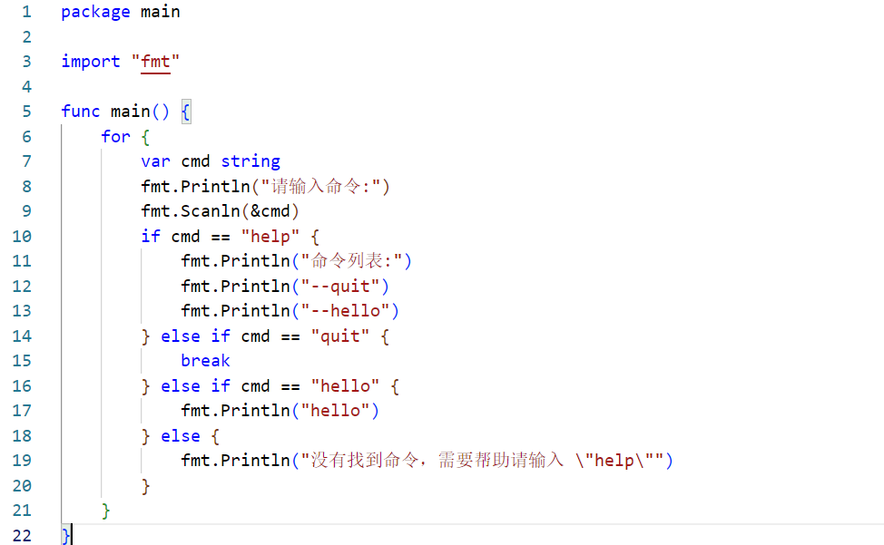

Homework1实验要求：

选用go或rust编写menu项目，创建一个版本库（gitee或github），采用VS Code作为编译调试环境。撰写一个帖子，从创建版本库、配置VS Code编译调试环境、编写menu第一版简单程序，以及最终调试运行，完整记录下来，目标是为go或rust的开发者提供一个开发环境配置和工作流程的参考。

环境配置：

windows11

实验过程：

1. 在GitHub上创建新仓库menu，并clone到本地

   仓库地址：https://github.com/lingy-qd/menu

   

2. 下载并安装go

   go官网：https://golang.google.cn/dl/

   从官网下载go安装包，下载完成后根据提示完成安装。

   

   在cmd中验证是否安装成功，如下图所示，成功：

   

   配置代理，在系统环境中增加下面三个变量：

   

3. VSCode安装go插件

   在VSCode扩展中搜索go，安装下图插件。安装完成后重启VSCode。

   

4. 编写第一版menu程序

   根据要求编写第一版menu程序，在终端测试成功。

   

   

5. 推送到远程仓库

   在GitHub Bash中将这一版本的menu推送到远程仓库。

   

   查看远程仓库，文件已经被成功推送。

   

学号后三位：093